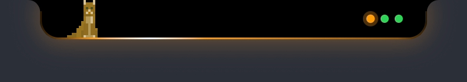
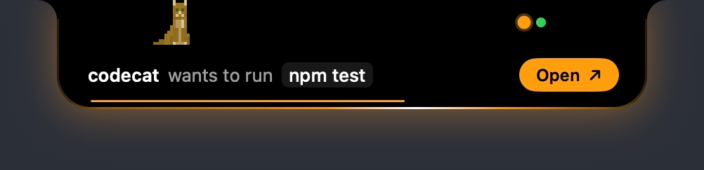
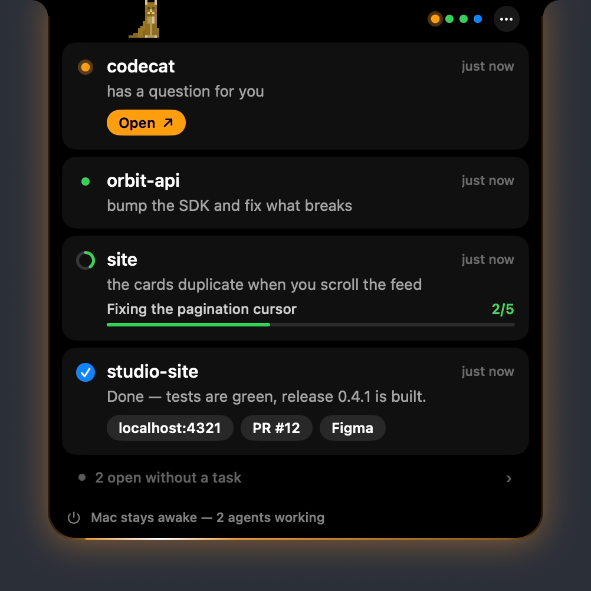
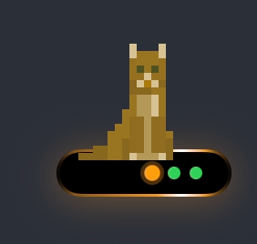
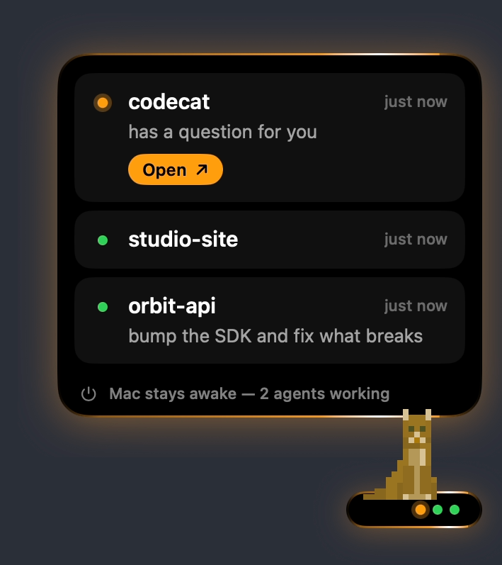
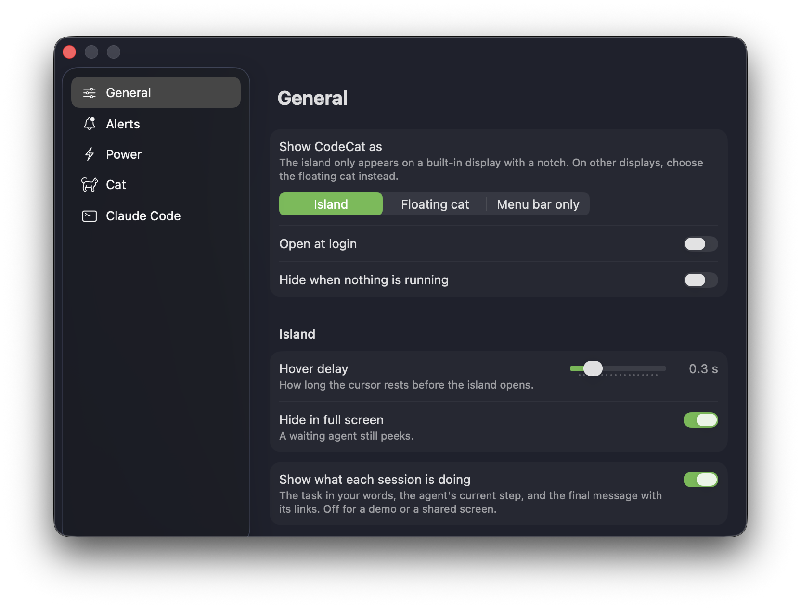
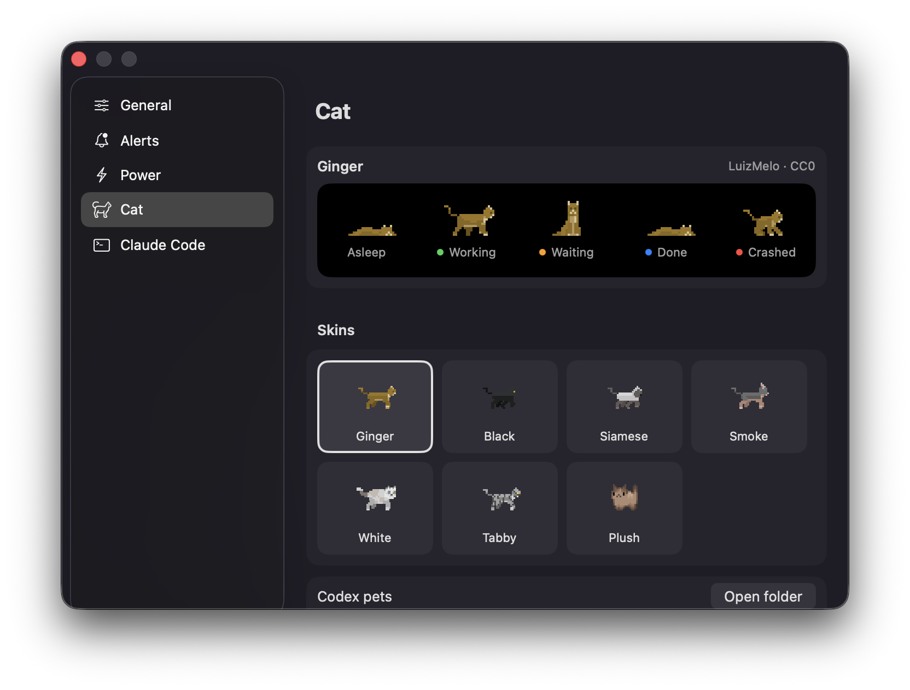

# CodeCat 🐈

A menu-bar cat that watches your Claude Code sessions, keeps the Mac awake while
agents are working, and waves a paw when one of them needs you.


## How it works, in 30 seconds

Claude Code fires hooks on five session events. CodeCat installs a tiny binary
(`codecat-hook`) as the handler for all five; it forwards each event over a unix
socket to the app, which keeps the state of every live session. Transcripts in
`~/.claude/projects` fill in the detail — which project, and what the agent is
doing right now ("editing api.ts", "running a command").

That state drives three things: the cat's pose, an IOKit power assertion that
keeps the Mac awake while any agent is working, and a list you can click to jump
straight to the terminal tab a session lives in.

Nothing leaves the machine. There is no network code in CodeCat at all.

## Install

Download the latest `CodeCat-<version>.dmg` from
[Releases](https://github.com/tim-zagirov/codecat/releases), open it, drag
`CodeCat.app` to `/Applications`, and launch it. The build is signed and
notarised, so it opens on a double-click — no right-click-and-Open dance.

Then:

1. **Connect…** — the first time you open the island it offers to install
   Claude Code's hooks; it is also in **Settings › Claude Code**. Without them
   CodeCat still works, but it learns about session changes late (from
   transcripts rather than events).
2. Optionally **Settings › Power › Keep agents running with the lid closed** —
   asks for an administrator password once.

Settings open from "•••" in the open island, from the menu-bar symbol, and
with ⌘, in any CodeCat window.

A Homebrew cask is planned but does not exist yet.

Requires macOS 14 or later. Apple silicon and Intel.

## What it does

- **Tracks every local Claude Code session** — CLI and the desktop app — in real
  time.
- **Shows a cat.** It sleeps when nothing is running, walks while agents work,
  sits and looks at you when one is waiting for you, crouches when a session
  dies, and stretches out and settles down when the work is done. Eight sprite
  skins to pick from, and any pet in the Codex pet format.
- **Lives in the notch.** The *island* is a black slab drawn around the notch of
  a built-in display. Its rim lights up in the state's colour — green working,
  orange waiting, blue done, red crashed — and a highlight runs along it while an
  agent waits. The right wing shows one dot per session, or the one session's
  progress.
- **Opens on hover** into one list: a card per session, sessions with nothing to
  do folded into one line, and a footer saying whether the Mac is being kept
  awake.
- **Peeks when an agent needs you.** The island opens itself for a few seconds
  and says why — "wants to run `npm test`", "has a question for you", the first
  line of a finished turn — with an Open button. Two at once become one "2
  agents need you"; after the screen was locked, one "While you were away"
  summary.
- **Jumps to a session.** Click a card and you land in the exact terminal tab
  that session is running in.
- **Says where each session is.** The card shows the agent's current step and
  progress from its own task list.
- **Hands over the result.** When a turn ends, the card shows the agent's last
  line and chips for the links in it — the dev server, the PR, the file. Click
  opens, drag carries it into a browser window.
- **Or floats.** On a Mac without a notch, or by choice, the cat stands on a
  small capsule you drag where you like; it peeks and opens the same cards.
- **Keeps the Mac awake** while agents work, and lets it sleep again once they
  stop.
- **Closed-lid mode.** Shut the laptop and walk away; the agents keep going.
- **A Settings window** for all of it — what to show, when to peek, power, the
  cat, and the Claude Code hooks.

<p>
  
</p>
<p>
  
</p>
<p>
  
</p>
<p>
  
  
</p>
<p>
  
  
</p>

## Pets in the Codex pet format

CodeCat can wear any pet drawn for the Codex pet format — the pixel pets people
hatch with the `hatch-pet` skill or download from community galleries. A pet is
a folder with a `pet.json` and an 8-column × 9-row sprite sheet (1536×1872 is the
canonical size, PNG or WebP). Drop the folder into either of these, and it appears
in **Settings › Cat** the next time you open it:

- `~/.codex/pets/<pet>/` — where Codex keeps them (`$CODEX_HOME/pets` when that
  variable is set), so pets you already have just show up
- `~/Library/Application Support/CodeCat/Pets/<pet>/` — CodeCat's own folder; a
  pet here overrides a same-named one in the Codex folder

CodeCat plays five of the nine rows: `idle` while sleeping, `running` while
agents work, `waiting` when one needs you, `failed` for a problem, and `jumping`
then `review` when the work is done. Pets are read where they are and never
copied or redistributed; each keeps its author's own terms. A folder that is not
a valid pet is skipped and named once in `codecat.log`.

## Hooks: what gets written, and how to take it back

**Connect…** merges one entry per event into
`~/.claude/settings.json`:

```jsonc
{
  "hooks": {
    "SessionStart":     [{ "hooks": [{ "type": "command", "command": "/Applications/CodeCat.app/Contents/MacOS/codecat-hook" }] }],
    "UserPromptSubmit": [{ "hooks": [{ "type": "command", "command": "/Applications/CodeCat.app/Contents/MacOS/codecat-hook" }] }],
    "Stop":             [{ "hooks": [{ "type": "command", "command": "/Applications/CodeCat.app/Contents/MacOS/codecat-hook" }] }],
    "Notification":     [{ "hooks": [{ "type": "command", "command": "/Applications/CodeCat.app/Contents/MacOS/codecat-hook" }] }],
    "SessionEnd":       [{ "hooks": [{ "type": "command", "command": "/Applications/CodeCat.app/Contents/MacOS/codecat-hook" }] }]
  }
}
```

Five events, one binary, no arguments. Every other key in the file — your
permission allowlist, MCP servers, other people's hooks — is preserved exactly,
and installing twice does not duplicate anything.

`codecat-hook` reads the event on stdin, sends it to
`~/Library/Application Support/CodeCat/hook.sock`, and exits. It never blocks
Claude Code: if CodeCat is not running, the send fails, the hook writes one line
to the log and exits 0.

**To remove them:** **Settings › Claude Code › Remove hooks…**. It deletes only
entries whose command is CodeCat's own and leaves everything else alone. Do this
*before* deleting the app — otherwise five entries pointing at a binary that no
longer exists stay in your settings, and Claude Code will try to run them on
every event of every session.

Full uninstall:

```bash
# 1. Remove the hooks in Settings › Claude Code first, then:
sudo bash /Applications/CodeCat.app/Contents/Resources/uninstall-lid-mode.sh  # if you enabled lid mode
rm -rf /Applications/CodeCat.app
rm -rf ~/Library/Application\ Support/CodeCat
```

## Closed-lid mode, and exactly what it may do as root

macOS sleeps when you close the lid, which kills whatever your agents were in the
middle of. Closed-lid mode toggles `pmset -a disablesleep` while agents are
working and clears it when they stop.

`pmset -a disablesleep` needs root, so enabling this once runs
`scripts/install-lid-mode.sh` under an administrator password. It installs
exactly two things.

**1. A sudoers rule at `/etc/sudoers.d/codecat`**, for your user only:

```
<you> ALL=(root) NOPASSWD: /usr/bin/pmset -a disablesleep 1, /usr/bin/pmset -a disablesleep 0
```

Two literal command lines. Not `pmset` in general, not a wildcard — the two exact
argument vectors CodeCat runs and nothing else. `visudo -cf` validates the file
before it is installed.

**2. A launch daemon, `com.codecat.sleepreset`**, which every 60 seconds asks: is
CodeCat running? If yes, it does nothing at all. If no, and `SleepDisabled` is
still 1, it clears it. That is the safety net for a crash or a Force Quit while
the flag was set — without it the flag would survive until the next reboot. It
checks before it writes, so an idle Mac is not having its energy preferences
rewritten by root once a minute forever.

`scripts/uninstall-lid-mode.sh` removes both.

## Privacy

- **No network.** CodeCat makes no outbound connections. There is no analytics,
  no telemetry, no crash reporting, no update check.
- **Reads** `~/.claude/projects` (session transcripts) and
  `~/.claude/settings.json` (only to add or remove its own hook entries).
- **Writes** only to `~/Library/Application Support/CodeCat` — the socket, a
  route cache, and a log.
- The log at `~/Library/Application Support/CodeCat/codecat.log` rotates at 1 MB
  and never exceeds two files. It stays on your disk; nothing reads it but you.

## Building from source

```bash
git clone https://github.com/tim-zagirov/codecat.git
cd codecat
swift test        # 697 tests
make app          # dist/CodeCat.app, ad-hoc signed — fine on your own machine
```

`make app` is all you need for local use. Distribution needs a Developer ID
certificate and a notarisation profile — see [docs/release.md](docs/release.md)
for `make sign` / `make notarize` / `make release` and the exact credentials to
set up.

One skin ("Silver") is not in this repository: its author allows using the
sprites but not redistributing the files. `make bundle` runs
`scripts/fetch-optional-assets.sh`, which downloads it from itch.io. If that
fails — offline, or itch.io changed its download flow — the build succeeds and
the skin simply does not appear. See [THIRD_PARTY_NOTICES.md](THIRD_PARTY_NOTICES.md).

### What is and is not verified

Automatically, on every `swift test`: all of `CodeCatCore` — hook and transcript
parsing, aggregate session status, the power assertion, the peek scheduler, the
`settings.json` rewrite, the process-tree walk that picks a jump route, the
sprite registry against the real PNGs, and both string catalogs against the call
sites. The build additionally checks that the assembled `.app` really contains
the skins and the string catalog.

By hand, because an `LSUIElement` app has no window for a screen-control tool to
find: everything in [docs/verification-checklist.md](docs/verification-checklist.md).
Closed-lid mode in particular has never run end to end on a machine — it needs an
administrator password, so it was never executed during development.

## Credits and licence

CodeCat's source code is [MIT](LICENSE) © 2026 Timur Zagirov.

The cats are not. Sprite artwork belongs to its authors and ships under their
terms — the full list, with sources and licences, is in
[THIRD_PARTY_NOTICES.md](THIRD_PARTY_NOTICES.md):

- **LuizMelo**, [Pet Cats Pack](https://luizmelo.itch.io/pet-cat-pack) — CC0 1.0.
  Six of the eight skins.
- **Maze.Bit.Boutique (mxmaze)**, [16-Bit Kitty](https://mxmaze.itch.io/16-bit-kitty-free)
  — **CC BY 4.0**. Attribution is required, and is shown in the app under *Settings ›
  Cat › Artists and licences* as well as here.
- **Elthen's Pixel Art Shop**,
  [2D Pixel Art Cat Sprites](https://elthen.itch.io/2d-pixel-art-cat-sprites) —
  author's own terms. Downloaded at build time, not redistributed here.
